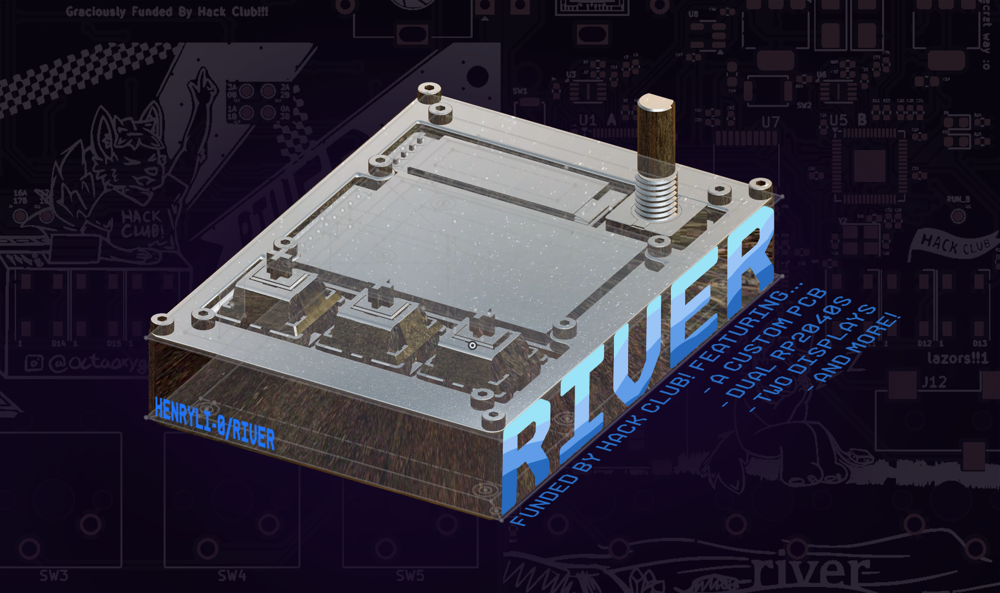

    <h2>River</h2>
    
by <a href= "https://github.com/HenryLi-0/river"> @HenryLi-0 </a>

    

All designs are open source! Hardware licensed under CERN OHL S v2.

# River

a quick stepping stone

---

## What this?

A couple of months ago, after listening to [archived](https://archive.org/details/the-sport-saver?webamp=default) [music](https://archive.org/details/under-the-ground?webamp=default) on the Internet Archive with Webamp, I thought the graphics on the right side (powered by Milkdrop) were pretty cool. I've always liked how Geometry Dash levels *typically* have well synced gameplay, since it's just so satisfying. Additionally, I also dislike how everything is switching to streamsing services (both because of the subscription model and more importantly the amount of cellular data it uses lol), so I basically wanted to bring music-synced graphics onto a portable offline device!

So, River is a relatively small PCB, hosting a dual RP2040 setup, each having custom firmware! The first one handles all the user controls, file loading, and the audio jack, while the second handles the display math, communicating with the first RP2040 by SPI and UART. Through this (rather unconventional) setup, audio can play continously while the second RP2040 works on more taxing graphics using the Pico SDK for C, with the second RP2040 basically just doing the graphics. It does this by having a PCM5101A and a TPA6132A2RTE into a TRS audio jack!

In retrospect, this project wasn't exactly a quick stepping stone (as in, it took over fifty hours of development), but it sure did review many topics surrounding PCB design with KiCAD, building on to what I learned from Hackpad and Raven! Originally, this was in case [fermion](http://github.com/HenryLi-0/fermion) would require a custom PCB, but who knows if it'll need one in the end. Anyways, working on River did teach a lot, as well as letting me have fun creating art for it!

---

Huge thanks to [this](https://blueprint.hackclub.com/starter-projects/devboard) guide from Blueprint and [this](https://pip-assets.raspberrypi.com/categories/814-rp2040/documents/RP-008279-DS-1-hardware-design-with-rp2040.pdf) documentation from Raspberry Pi for valuable information on RP2040 wiring design. Thanks!

---

## Pictures!

---

## Directory

- [CAD](</cad/README.md>)
    - The case is made in Onshape!
- [Firmware](</firmware/README.md>)
    - Two firmwares for the two RP2040s!
- [Updatelogs](</updatelogs/>)
    - As always, lots of behind the scenes content! It's also a decently long read as always :D
- [BOM](</BOM.csv>)
    - Want to build one yourself? Here's the BOM in CSV form! However, I suggest using the Google Sheets one, check down below for that!

---

## Usage

Assembly
1. First, one must obtain the PCB! It's not really made for hand-soldering, more so for JLCPCB's or any other PCBA service to assemble (but feel free to give it a try if super experienced!).
2. The main PCB's here? Great! Flash the two RP2040s with their specific firmwares and make sure all status LEDs and storage works! (Same process as testing a devboard, except there's not really any free pins...)
3. Once the RP2040s are confirmed to be in good condition, test the micro SD card slot and the audio jack! A micro SD card and a TRS audio plug (usually in random earbuds) are needed! Load music on and see if it works (after setting the firmware to play a song from the micro SD card).
4. Once those also work, solder on the displays and keys! This should be fairly straightforward, watch a soldering tutorial if needed! (Yes, a soldering iron is also needed!)
5. Assemble everything into the case and screw in the M2 screws! Adjust the case if needed if the audio plug doesn't fit well with the current slot!

---

## BOM

Note: This list was made in mid-September 2026. Depending on a ton of factors, this price may change over time, so these prices may be different! Multiple parts are sourced by me (since I have a bunch of extra parts laying around), so it will likely cost a bit more. Currently, shipping and tax estimates are included (to NYC), check out the `updatelogs` whenever construction occurs to find the actual price it resulted in!

[Here's](https://docs.google.com/spreadsheets/d/1_4eaDKRTe7VvPdyKRilJCp6rfzp3SGLLEaJtn6RHo0M/edit?gid=0#gid=0) the original Google Sheets BOM, color coded too! (It'll also be more updated, but I'll try to sync this one too!)

| Part                                      | Price         | Link          |
|-------------------------------------------|---------------|---------------|
| Board PCB (PCBA)                          | $84.61        | JLCPCB        |
| M2 Screws (16mm, 50pcs)                   | $1.41         | [AliExpress](https://www.aliexpress.us/item/3256804341271555.html) |
| 128x32 OLED Display (White, 1pc)          | $2.44         | [AliExpress](https://www.aliexpress.us/item/3256808453793642.html) |
| 128x160 TFT Display (1.8 inch TFT)        | $4.06         | [AliExpress](https://www.aliexpress.us/item/3256807859088652.html) |
| WS2812B LEDs (3)                          | $0.00         | Anywhere      |
| Micro SD Card (1)                         | $0.00         | Anywhere      |
| EC11 Rotary Encoder (1)                   | $0.00         | Anywhere      |
| Cherry MX Switch (3)                      | $0.00         | Anywhere      |
| Estimated Shipping (JLCPCB to NYC)        | $11.05        | JLCPCB        |
| Estimated Shipping (AliExpress to NYC)    | $0.00         | AliExpress    |
| Buffer                                    | $5.00         |               |
| TOTAL                                     | $108.57       |               |